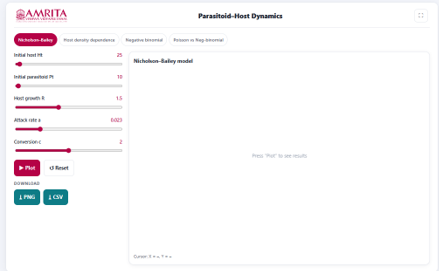
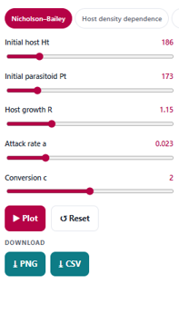
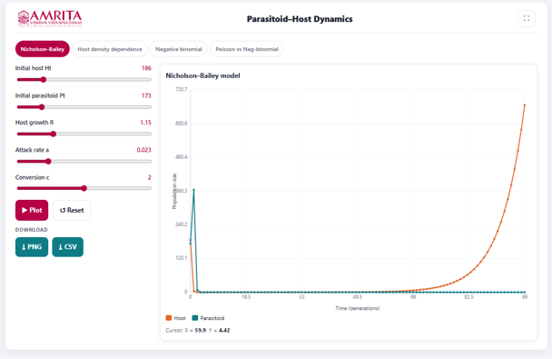

### Procedure

1. The simulator enables users to investigate the interaction between host and parasitoid populations using the Nicholson–Bailey model and related analytical models. Users can configure the host and parasitoid population parameters, execute the simulation, visualize the population dynamics, and compare the effects of different ecological conditions on host–parasitoid
 
&nbsp;

2. The simulator consists of a parameter panel on the left and a visualization panel on the right for displaying graphical outputs
 
&nbsp;

 
&nbsp;

3. Select the desired analysis tab from the options provided at the top of the simulator. The available analyses include-Nicholson–Bailey, Host Density Dependence, Negative Binomial, Poisson vs Negative Binomial.

 
&nbsp;

4. Select the Nicholson–Bailey tab to investigate the classical host–parasitoid interaction model.
 
&nbsp;

5. Specify the initial host population (Hₜ) using the corresponding slider. This parameter defines the number of host individuals present at the beginning of the simulation.
 
&nbsp;

6. Specify the initial parasitoid population (Pₜ) using the corresponding slider. This parameter represents the initial number of parasitoids interacting with the host population.
 
&nbsp;

7. Adjust the host growth rate (R) using the Host growth R slider. This parameter determines the reproductive potential of the host population in the absence of parasitoid attack.
 
&nbsp;

8. Specify the parasitoid attack rate (a) using the corresponding slider. The attack rate determines the efficiency with which parasitoids locate and parasitize host individuals.
 
&nbsp;

9. Adjust the conversion coefficient (c) using the Conversion c slider. This parameter represents the efficiency with which successfully parasitized hosts are converted into new parasitoid individuals in the subsequent generation.
 
&nbsp;

10. After configuring all simulation parameters, click the Plot button to generate the graphical output based on the selected parameter values.

 
&nbsp;

11. Observe the graph displayed in the visualization panel. The graph illustrates the variation in the host and parasitoid populations over successive generations predicted by the Nicholson–Bailey model.
 
&nbsp;

12. Interpret the X-axis (Time – Generations) to determine the progression of the simulation and the Y-axis (Population Size) to examine changes in the population sizes of the host and parasitoid throughout the simulation.
 
&nbsp;

13.	Use the graph legend to distinguish between the population curves of the Host and the Parasitoid. Compare the population trajectories of both species to examine how changes in the host population influence the parasitoid population and vice versa during successive generations.
 
&nbsp;

14.	Observe the population trends throughout the simulation to determine whether the populations increase, decrease, fluctuate, or approach local extinction under the selected parameter values. Move the cursor over the graph, if required, to display the corresponding coordinate values beneath the graph. These values indicate the population size at a particular generation.
 
&nbsp;

15.	Modify one or more simulation parameters, such as the initial host population (Hₜ), initial parasitoid population (Pₜ), host growth rate (R), attack rate (a), or conversion coefficient (c), and generate the graph again to investigate how these parameters influence host–parasitoid dynamics.
 
&nbsp;

16. Click the Reset button, if required, to restore the default simulation parameters before performing another simulation.
 
&nbsp;

17. Download the graphical output by clicking the PNG button or export the numerical simulation data by clicking the CSV button for further analysis and comparison.
 
&nbsp;

18. Repeat the above procedure using different combinations of model parameters to compare the resulting population dynamics and investigate the effects of host reproduction, parasitoid attack efficiency, and conversion rate on the long-term behaviour of the host–parasitoid system.

