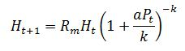
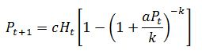
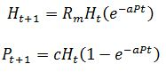
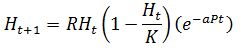

The parasitoids are a group of insects those lay their eggs in, on or near other insects. The larval parasitoid then develops inside or on its host and eventually it almost consumes the host and therefore kills it. For parasitoids that feed as larvae on plants, the rate of ‘predation’ is determined mostly by the rate at which the adult females lay eggs. Each egg is an ‘attack’ on the prey or host, even though it is the larva that hatches from the egg that does the eating.

 

Most of the parasitoids are found to useful in controlling insect pests as they are highly specialized. That is, when their host species become scarce, they do not switch to new host species. Parasitoids are effectively useful when they maintain their host population at a low density. This is better than causing extinction because if the host goes extinct, then the parasitoid also goes extinct. Because of this the host may then recolonize the area from somewhere else.

 

Parasitoid-host dynamics is governed fundamentally by the searching behavior of the parasitoid and the spatial distribution of the host. This experiment helps to understand the two different mathematical models that differ in their dispersion pattern of the host population. The two models used in this exercise are, Nicholson-Bailey model, developed by A.J. Nicholson and V.A. Bailey in 1935 and the second is the negative binomial model, which is developed by the Australian ecologist Robert May in 1978. The Nicholson-Bailey model uses the Poisson distribution define the dispersion pattern, whereas the negative binomial model uses the negative binomial probability distribution to define the same.

&nbsp;

#### The Negative Binomial Model of Parasitoid-Host Population Dynamics
 

The negative binomial model is written in discrete time as the life cycles of both parasitoid and host are usually synchronized by the seasons. Discrete time models are used to describe biological phenomena or events for which it is natural to regard time at fixed (discrete) intervals.

&nbsp;

##### The population density of the host:

 

The population density of the host in the next year is the maximum rate of geometric growth (Rm) times the number of hosts in the population now (Ht) times the probability that an individual in the population will not be parasitized.

That is;

Here, the term in the brackets is the probability of a host not being found. Where Ht is the ‘initial population of hosts’, Pt is the ‘initial population of female parasitoids’, Rm is the ‘Reproductive rate of host without parasitism’, a is the ‘searching efficiency of the parasitoid’ and k is the ‘clumping factor’ that describes the dispersion pattern of the host population.

&nbsp;

##### The population density of the parasitoid:

The population density of the parasitoid is predicted, from one year to the next, by the number of new parasitoids produced from each host (c) times the number of parasitoids now (Pt) times the probability that each parasitoid finds a host, which is one minus the probability that a host will not be found. The model is as follows.

Where, Ht is the ‘Initial population of hosts’, Pt is the ‘initial population of female parasitoids’, a is the ‘searching efficiency of the parasitoid’, Rm is the ‘Reproductive rate of host without parasitism’, c is the ‘Average number of female parasitoids produced from each host’ and k is the ‘clumping factor’.

&nbsp;

### The Nicholson-Bailey Model of Parasitoid-Host Population Dynamics: Poisson distribution
 

The Nicholson-Bailey model of parasitoid-host dynamics assumes that the probability of host being not found follows Poisson distribution. The Poisson distribution resembles the negative binomial distribution with a relative large ‘clumping factor’ (k).

 

In Poisson distribution, the probability that a host will not be detected is equal to e-aP . Where a is the searching efficiency of the parasitoid and P is the number of parasitoids whereas in negative binomial model, the probability that a host will not be detected is equal to  ( 1 + aPt / k )-k .

When the Poisson distribution is substituted for the negative binomial distribution, we get the following equations for the host and parasitoid.

Where, Ht is the ‘Initial population of hosts’, Pt is the ‘Initial population of female parasitoids’, Rm is the ‘Reproductive rate of host without parasitism’, a is the ‘Searching efficiency of the parasitoid’ and c is the ‘Average number of female parasitoids produced from each host’.

&nbsp;

Adding carrying capacity to the host population, we get

 

 

Where, ‘K’ is the carrying capacity of the host population.

 